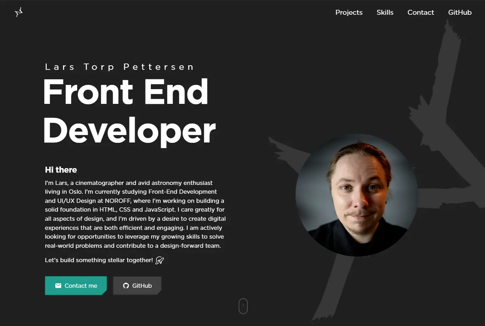

# Portfolio - Lars Torp Pettersen

## Project Documentation: Personal Portfolio Website



### Contents:

<details>
  <summary>Table of Contents</summary>
  
  [1. Project Overview](#1-project-overview)

- [Project Links](#project-links)
- [Live Demo](#live-demo)

[2. Setup & Installation](#2-setup--installation)

[3. Technologies Used](#3-technologies-used)

[4. Folder Structure](#4-folder-structure)

[5. Features](#5-features)

[6. Project Management](#6-project-management)

[7. Accessibility and SEO](#7-accessibility--seo)

[8. Performance](#8-performance)

[9. Browser Support](#9-browser-support)

[10. Credits](#10-credits)

[11. Inspiration](#11-inspiration)

[12. Contact](#12-contact)

</details>

---

## 1. Project Overview

A modern, responsive portfolio website showcasing my front-end development projects and skills so far. Built with vanilla HTML, CSS, and JavaScript, the site features a clean design system, smooth animations, and an advanced project management system with JSON-based data structure.

This portfolio demonstrates my progression through the first year NOROFF Front End Development course (and beyond), featuring enhanced project cards, DRY styling principles, and a comprehensive CLI-based project management workflow that hopefully works.

### Project Links:

- GitHub Repo: [https://github.com/larstp/larstp.github.io](https://github.com/larstp/larstp.github.io)
- Live Site (GitHub Pages): [https://larstp.github.io](https://larstp.github.io)

### Live Demo:

The portfolio is live and continuously deployed via GitHub Pages. Visit the link above to explore the latest version with all interactive features.

## 2. Setup & Installation

### Quick Start:

```bash
# Clone the repository
git clone https://github.com/larstp/larstp.github.io.git

# Navigate to project directory
cd larstp.github.io

# Install dependencies (for CLI tools)
npm install

# Open with Live Server or serve locally
# No build steps required - static site ready to deploy
```

### Development Tools:

```bash
# Add a new project interactively
npm run add-project

# Validate project data consistency
npm run validate-data
```

## 3. Technologies Used

### Core Technologies:

- **HTML5** - Semantic markup and accessibility
- **CSS3** - Modern layouts with Flexbox/Grid, custom properties, clip-path
- **JavaScript (ES6+)** - Modules, async/await, Intersection Observer API

### Services:

- **Web3Forms** - Contact form backend service for secure form submissions
- **GitHub Pages** - Static site hosting and deployment

### Development Tools:

- **JSON** - Data structure for projects and technologies
- **GitHub Actions** - Automation workflows (examples provided)

### Design System:

- **Custom CSS Variables** - Consistent theming
- **Clip-path** - Angled corner design elements
- **DRY Principles** - Shared button system and utilities

## 4. Folder Structure

```
├── public/                    # Static assets
│   ├── assets/
│   │   ├── icons/            # SVG icons and logos
│   │   ├── images/           # Project screenshots and photos
│   │   └── videos/           # Demo videos
│   └── links/                # External link redirects
├── src/                      # Source code
│   ├── css/
│   │   ├── utils/           # Component styles
│   │   │   ├── skills.css   # Interactive skills section
│   │   │   ├── header.css   # Navigation components
│   │   │   └── ...          # Other component styles
│   │   ├── index.css        # Main stylesheet
│   │   └── style.css        # Global utilities
│   ├── js/
│   │   └── utils/           # JavaScript modules
│   │       ├── skills.js    # Skills section functionality
│   │       ├── smoothScroll.js # Shared scrolling utilities
│   │       └── ...          # Other modules
│   ├── data/               # JSON data files
│   │   ├── projects.json   # Project metadata
│   │   └── technologies.json # Technology definitions
│   └── pages/              # Additional HTML pages
├── tools/                   # CLI development tools
│   ├── add-project.js      # Interactive project creation
│   └── validate-projects.js # Data validation
├── documentation/          # Project documentation
└── .github/               # GitHub workflows and templates
```

## 5. Features

### User Experience:

- **Responsive Design** - Mobile-first approach with desktop enhancements
- **Smooth Scrolling** - Custom easing functions for natural navigation
- **Smart Navigation** - Scroll-based active section highlighting
- **Interactive Cards** - Hover effects and clipped borders because sci-fi is cool
- **Interactive Skills Section** - Technology showcase with grayscale-to-color hover effects
- **Mobile-Optimized Skills** - Full-color display on touch devices
- **Contact Form** - Functional contact form powered by Web3Forms with custom notifications
- **Performance Optimized** - Lazy loading and efficient animations

### Project Management:

- **JSON-Based Data** - Centralized project information
- **CLI Tools** - Easy project addition and validation
- **Technology Tagging** - Consistent color-coded technology labels
- **Automated Validation** - Data integrity checks
- **GitHub Integration** - Workflow examples for automation

### Design System:

- **Clipped Elements** - Consistent angled corner aesthetic
- **DRY Button System** - Shared styling with variants (.btn-primary, .btn-secondary)
- **Custom Properties** - CSS variables for theming
- **Icon Integration** - SVG icons with hover states
- **Skills Categories** - Modular skill organization (Programming, Frontend, Tools, Creative Software)
- **Responsive Interactions** - Desktop hover effects, mobile-optimized display

## 6. Project Management

### Adding New Projects:

```bash
# Interactive CLI tool
npm run add-project

# Validates data and provides guidance
npm run validate-data
```

### Data Structure:

Projects are managed through `src/data/projects.json` with comprehensive metadata including:

- Title, description, and image assets
- Technology stack with color-coded tags
- Live demo and repository links
- Featured status and creation dates
- Backward compatibility with legacy formats

### Automation:

Example GitHub Actions workflows provided for:

- Automated project validation
- Security scanning
- Deployment workflows

## 7. Accessibility & SEO

### Accessibility Features:

- **Semantic HTML** - Proper heading hierarchy and landmarks
- **Keyboard Navigation** - Full keyboard accessibility
- **Screen Reader Support** - ARIA labels and descriptions
- **Color Contrast** - WCAG AA compliant color schemes
- **Focus Management** - Visible focus indicators

### SEO Optimization:

- **Meta Tags** - Open Graph and Twitter Card support
- **Semantic Markup** - Schema.org structured data
- **Performance** - Optimized loading and Core Web Vitals
- **Mobile-First** - Responsive design principles

## 8. Performance

### Optimization Techniques:

- **CSS Custom Properties** - Efficient theming system
- **Modular JavaScript** - ES6 modules for better loading
- **Intersection Observer** - Efficient scroll-based animations
- **Minimal Dependencies** - Vanilla JavaScript approach
- **Optimized Assets** - Compressed images and SVG icons

### Core Web Vitals:

- **LCP** - Optimized with efficient loading strategies
- **FID** - Minimal JavaScript blocking
- **CLS** - Stable layouts with CSS Grid/Flexbox

## 9. Browser Support

- **Modern Browsers** - Chrome, Firefox, Safari, Edge (latest versions)
- **Progressive Enhancement** - Graceful degradation for older browsers. I suggest just switching to Vivaldi<3
- **CSS Features** - clip-path, CSS Grid, Custom Properties
- **JavaScript** - ES6+ with module support

## 10. Credits

### Assets & Components:

- **Mouse Scroll Animation** - [Deepak K Vijayan](https://codepen.io/deepakkv/pen/WwmjKQ) (MIT License)
- **Icons** - Custom SVG icons and [Iconify](https://iconify.design/) icon collections
- **Images** - Personal project screenshots and professional photography

### Services:

- **Web3Forms** - [web3forms.com](https://web3forms.com) - Contact form backend service for secure, spam-free form submissions

### Development Tools:

- **GitHub Copilot** - AI coding assistance and suggestions
- **VS Code** - Primary development environment
- **Node.js** - CLI tooling and automation. (Develop only)

See full attribution details in [documentation/documentstion.md](documentation/documentstion.md)

## 11. Inspiration

### Design Inspiration:

- **Gabriel Carvalho** - [gabrielcarvalho.vercel.app](https://gabrielcarvalho.vercel.app) - Clean design, smooth animations
- **Ekrem Gürsoy** - [ekremgursoy.github.io](https://ekremgursoy.github.io/Ekrem-Gursoy-portfolio/#projects) - Project showcase layout
- **Chandra Sharma** - [ichandrasharma.vercel.app](https://ichandrasharma.vercel.app) - Modern typography, color schemes
- **Heuer** - [heuer.ovh](https://heuer.ovh) - Minimalist aesthetic, elegant animations
- **Hamish Williams** - [hamishw.com](https://hamishw.com/contact) - Interactive elements, creative layouts
- **Radiat** - [radiat.netlify.app](https://radiat.netlify.app) - Portfolio design and layout inspiration
- **Ragav S** - [ragavs-profile.netlify.app](https://ragavs-profile.netlify.app) - Profile presentation and styling

### Technical Inspiration:

- **Modern CSS Techniques** - clip-path, custom properties, logical properties
- **Progressive Enhancement** - Vanilla JavaScript best practices
- **Design Systems** - Component-based architecture

## 12. Contact

- **Author:** Lars Torp Pettersen
- **GitHub:** [larstp](https://github.com/larstp)
- **Portfolio:** [larstp.github.io](https://larstp.github.io)
- **Email:** Available through portfolio contact form

### Documents:

- **CV:** [Download PDF](public/links/CV.pdf)
- **Cover Letter:** [Download PDF](public/links/CoverLetter.pdf)

---

_This portfolio represents my journey in front-end development, showcasing both technical skills and design sensibility. Built with modern web standards and a focus on user experience. But I am in the beginning of my journey and I will continue to update as I get better._
